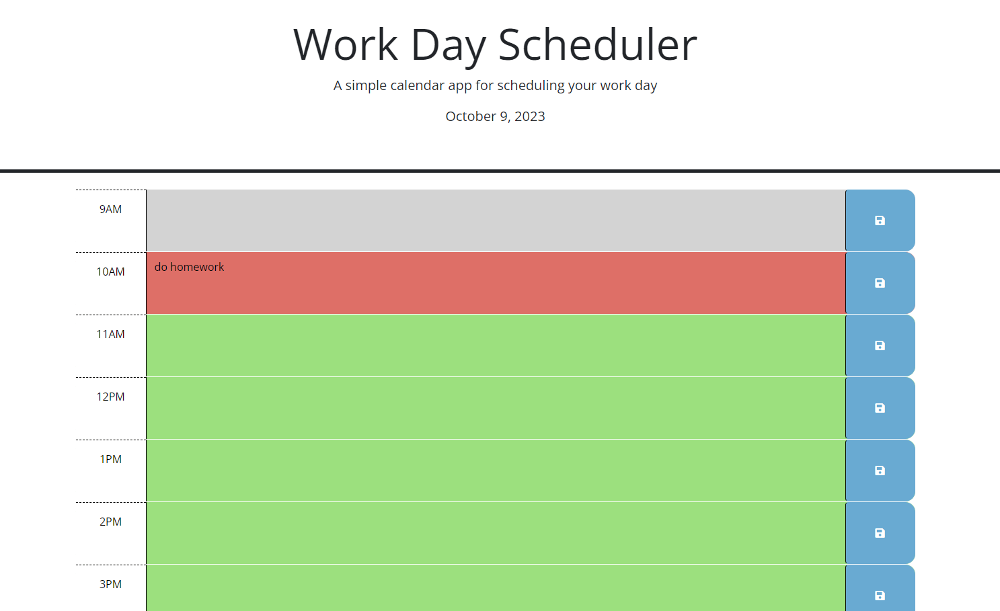

# Scheduler

## Summary
When the planner is opened, the current day is prominently displayed. As the user scrolls, they encounter time blocks from 9am to 5pm. These blocks are color-coded: past hours are distinguished from the current hour and upcoming hours. Within each time block, users can input events. By clicking the adjacent save button, their input is stored. Even after refreshing the page, these saved inputs remain intact.

## Screenshots

## Link
https://meerkat501.github.io/Scheduler/
